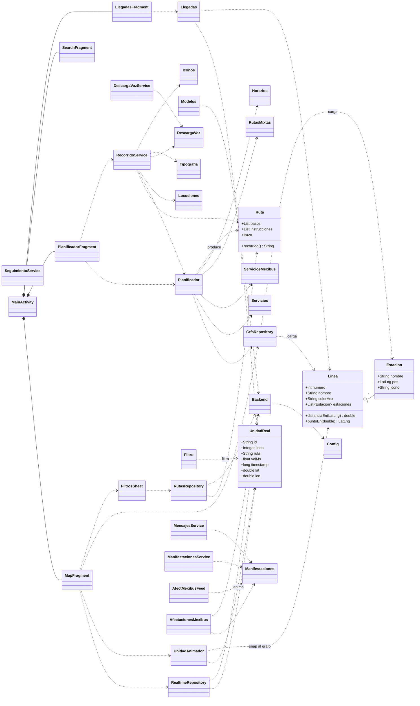

# UML — GeoMB App Móvil (Android)

Diagrama de clases (alto nivel) del paquete `com.memegrados.GeoMB`. Agrupado por subsistema.
Se muestran las clases principales y sus relaciones; los adapters/fragments secundarios se listan en el inventario al final.

> Relaciones: `o--` composición/agregación · `..>` usa/depende · `*--` contiene (host de fragments).

## Inventario completo de clases (por subsistema)

- **Modelo de datos:** `Linea`, `Estacion`, `Ruta`, `UnidadReal`.
- **Repositorios / datos:** `GtfsRepository`, `RutasRepository`, `RealtimeRepository`, `Horarios`, `Servicios`, `ServiciosMexibus`, `RutasMixtas`, `Modelos`, `Backend`, `Config`, `Modos`, `Idiomas`, `Iconos`, `Tipografia`.
- **Ruteo:** `Planificador`.
- **Tiempo real:** `UnidadAnimador`, `Llegadas`, `Filtro`, `Red`, `RedViewModel`.
- **Recorrido / voz:** `RecorridoService`, `SeguimientoService`, `Locuciones`, `DescargaVoz`, `DescargaVozService`.
- **Afectaciones:** `MensajesService`, `ManifestacionesService`, `Manifestaciones`, `AfectMexibusFeed`, `AfectacionesMexibus`.
- **Actividades / arranque / servicios:** `MainActivity`, `SplashActivity`, `LoginActivity`, `ArranqueReceiver`, `LlegadaService`, `SincronizacionService`.
- **Fragments:** `MapFragment`, `PlanificadorFragment`, `SearchFragment`, `LinesFragment`, `RutasFragment`, `EstacionesLineaFragment`, `LlegadasFragment`, `UnidadesFragment`, `ReporteFragment`, `AcercaFragment`.
- **Adapters / UI:** `LinesAdapter`, `RutasAdapter`, `EstacionesAdapter`, `EstacionRutaAdapter`, `UnidadesAdapter`, `LlegadasAdapter`, `AfectacionesAdapter`, `FiltrosSheet`.
- **KYC / reportes / perfil:** `DiditKYC`, `Verificacion`, `Perfil`, `ReporteIrregularidad`, `ReportePdf`, `Traductor`.
