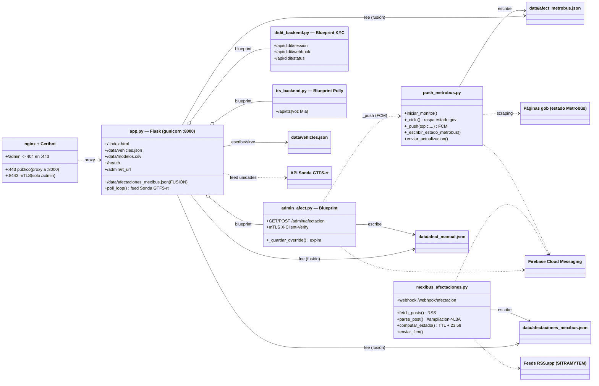

# UML — GeoMB Backend (Servidor EC2)

Diagrama de componentes/clases del backend (repo `metrobus_app`, en el EC2 `https://geomb.duckdns.org`).
Muestra los 3 procesos (servicios systemd), sus módulos, los archivos de datos que comparten y las fuentes externas.

> Relaciones: `..>` usa/llama · `-->` escribe/lee archivo · `o--` registra (blueprint).

## Notas
- **La app Android consume** `/data/afectaciones_mexibus.json` (fusión Mexibús + Metrobús + avisos manuales, calculada al vuelo)
  y `/data/vehicles.json`. El panel de estado ingiere cualquier línea (Metrobús 1–7 y Mexibús 10X+).
- **Seguridad:** el panel admin solo entra por `:8443` con certificado cliente (mTLS); `/admin` está bloqueado (404) en el `:443` público.
  Secretos (`firebase.json`, `.pem`, tokens) solo en el EC2, nunca al repo.
- **Servicios systemd:** `metrobus-web` (app.py), `metrobus-push` (push_metrobus.py), `mexibus-afectaciones` (mexibus_afectaciones.py).
- Detalle completo: `metrobus_app/CLAUDE.md` y `docs/SESION_2026-09_backend.md`.
